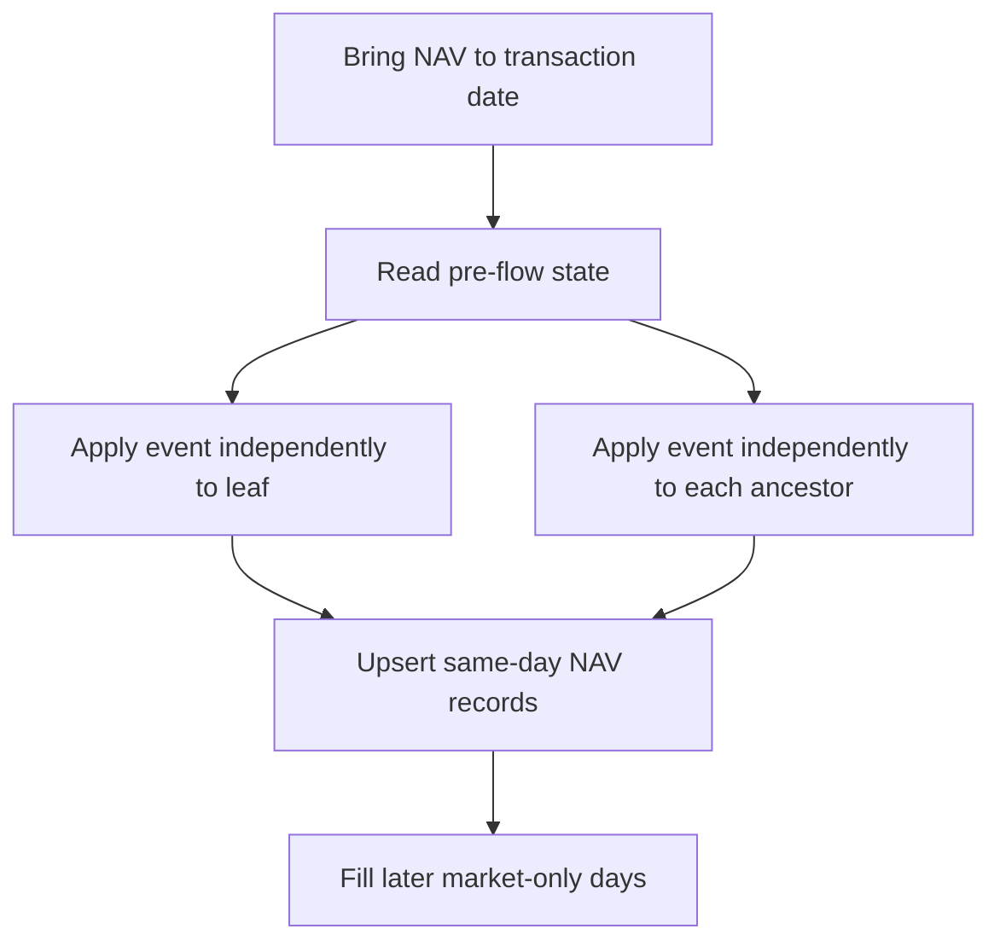

# FolioScope NAV Algorithms and Execution Flow

## 1. Purpose

FolioScope uses two different NAV operations:

1. `update_GroupNAV` processes a specific event such as a deposit,
   withdrawal, tax or market valuation.
2. `fill_MissingNAVs` creates daily market NAV records between two dates when
   no unprocessed external cash flow exists inside that period.

They solve different problems and must not replace each other.



## 2. NAV data model

Each NAV document contains:

```js
{
  portfolioGroupId,
  userId,
  date,
  units,
  value,
  nav,
  message,
}
```

The fundamental identity is:

```text
NAV = Value / Units
Value = NAV x Units
```

When units are zero, the group must also have zero value and its default NAV is
100.

## 3. Rules for changing value and units

| Event | Value | Units | NAV effect |
| --- | --- | --- | --- |
| Deposit | Increases | Increases | Unchanged at the flow instant |
| Withdrawal | Decreases | Decreases | Unchanged at the flow instant |
| Tax | Decreases | Unchanged | Decreases |
| Dividend | Increases | Unchanged | Increases |
| Market movement | Replaced by current total value | Unchanged | Changes |
| Buy | Cash becomes an asset | Unchanged | Changes only if market value differs from execution cost |
| Sell | Asset becomes cash | Unchanged | Changes only if market value differs from execution proceeds |

Only external capital flows issue or cancel units.

## 4. `calculateExternalFlowUnitUpdate`

`update_GroupNAV` calls `calculateExternalFlowUnitUpdate` for deposits and
withdrawals.

### 4.1 Pre-flow NAV

For an existing group:

```text
Pre-flow NAV = Current value / Current units
```

For a new empty group:

```text
Pre-flow NAV = 100
```

The helper rejects a group that has non-zero value but zero units because that
state cannot produce a valid NAV.

### 4.2 Deposit formula

For deposit amount `A`:

```text
Issued units = A / Pre-flow NAV
New units = Old units + Issued units
New value = Old value + A
New NAV = New value / New units
```

For a pure deposit:

```text
New NAV = Pre-flow NAV
```

The deposit changes ownership units, not investment performance.

### 4.3 Withdrawal formula

For withdrawal amount `A`:

```text
Cancelled units = A / Pre-flow NAV
New units = Old units - Cancelled units
New value = Old value - A
New NAV = New value / New units
```

For a pure withdrawal, NAV also remains unchanged at the withdrawal instant.

### 4.4 Example

Existing parent state:

```text
Value = 8,000
Units = 100
NAV = 80
```

Deposit:

```text
Amount = 1,000
Issued units = 1,000 / 80 = 12.5
New units = 112.5
New value = 9,000
New NAV = 9,000 / 112.5 = 80
```

The child receiving this deposit may start at NAV 100 and issue 10 child
units. The parent must issue 12.5 parent units because the parent NAV is 80.
Child units and parent units are independent.

## 5. `update_GroupNAV` algorithm

`update_GroupNAV` is an event-driven NAV updater for one group.

### 5.1 Inputs

```js
{
  session,
  portfolioGroupId,
  userId,
  date,
  type,
  amount,
  job,
}
```

Meaning of `amount` depends on `type`:

| Type | Meaning of `amount` |
| --- | --- |
| `deposit` | External money entering the group |
| `withdrawal` | External money leaving the group |
| `tax` | Tax expense deducted from group value |
| `market` | Absolute total current value, not a gain or loss amount |

Passing market profit instead of total market value will corrupt the NAV.

### 5.2 Date normalization

```js
date = normalizeToIST5PM(date);
```

Every event for the same Indian calendar day targets the same 5:00 PM IST NAV
document.

This creates one final NAV state per group per day.

### 5.3 Amount validation

```js
amount = Number(amount);
```

The function rejects:

- `NaN`;
- infinity;
- negative amounts.

The external-flow helper separately rejects a zero deposit or withdrawal.

### 5.4 Load the state

The query finds the latest NAV on or before the normalized event date:

```js
const last = await Nav.findOne({
  portfolioGroupId,
  userId,
  date: { $lte: date },
}).sort({ date: -1 });
```

If the same-day document already exists, the function reads that same-day
state, applies the next event and updates the same document.

Therefore multiple same-day events are processed sequentially.

### 5.5 First NAV entry

The intended first-entry rules are:

```text
First deposit:
  NAV = 100
  Units = deposit / 100
  Value = deposit

First market job with zero value:
  NAV = 100
  Units = 0
  Value = 0
```

A first market entry with positive value is rejected because value cannot exist
without units.

### 5.6 Load numeric fields

For an existing record:

```text
Units = last.units
Value = last.value
NAV = last.nav
```

These values represent the state before the new event.

### 5.7 Apply deposit or withdrawal

The function calls:

```js
calculateExternalFlowUnitUpdate({
  currentValue: value,
  currentUnits: units,
  amount,
  type,
});
```

The returned units and value replace the previous state.

### 5.8 Apply tax

```text
New value = Old value - Tax
Units remain unchanged
New NAV = New value / Existing units
```

Tax is an investment expense. It must reduce performance instead of cancelling
units.

The code rejects tax greater than the current value.

### 5.9 Apply market value

```js
value = amount;
```

For `market`, `amount` is the complete recalculated group value.

```text
Units remain unchanged
NAV = New total value / Existing units
```

### 5.10 Floating-point cleanup

Very small units and values below the epsilon are normalized to zero.

```js
if (Math.abs(units) < 0.0000001) units = 0;
if (Math.abs(value) < 0.0000001) value = 0;
```

This removes harmless floating-point remnants such as
`0.000000000000001`.

### 5.11 Recalculate NAV

```text
If units > 0:
  NAV = value / units

If units = 0:
  units = 0
  value = 0
  NAV = 100
```

### 5.12 Same-day upsert

The final state is written using the unique group, user and normalized date:

```text
portfolioGroupId + userId + date
```

If another event occurs on the same day, it updates this row instead of
creating another row.

The `message` field contains only the last same-day event because each update
overwrites it.

## 6. Applying an event to the hierarchy

`update_GroupNAV` updates only the supplied `portfolioGroupId`. The caller must
invoke it independently for the leaf and every ancestor.

Example hierarchy:

```text
NET WORTH
  Net Investment
    Unstable Assets
      Broad Equity ETFs
```

A deposit into `Broad Equity ETFs` is external capital for all four groups.

The caller must update:

```text
Broad Equity ETFs
Unstable Assets
Net Investment
NET WORTH
```

Each call reads that group's own pre-flow value and units. Each group therefore
issues a different number of units when its NAV differs.

Never do this:

```js
parentUnitChange = leafUnitChange;
```

Never do this:

```js
parentUnits = sum(childUnits);
```

### Correct caller structure

The caller should first bring the NAV state to the transaction date and then
process the full path inside the same MongoDB transaction:

```js
const groupPath = [leafId, parentId, grandParentId, rootId];

for (const groupId of groupPath) {
  await update_GroupNAV({
    session,
    portfolioGroupId: groupId,
    userId,
    date,
    type: "deposit",
    amount,
  });
}
```

The actual group statement should remain attached only to the leaf. Ancestor
NAV updates represent consolidated accounting and must not create duplicate
group statements.

## 7. Internal transfers between leaves

An internal transfer is not an external flow at every hierarchy level.

Example:

```text
Withdraw 1,000 from Child A
Deposit 1,000 into Child B
```

At the common parent and all ancestors above it:

```text
Net external flow = 0
Units must not change
```

Only the affected branches below the lowest common ancestor need unit-flow
updates. Treating both sides as independent parent withdrawal and deposit can
create unnecessary rounding and false unit changes.

## 8. `fill_MissingNAVs` algorithm

`fill_MissingNAVs` creates daily market records after unit-changing events have
already been processed.

Its central invariant is:

```text
Market movement changes value and NAV.
Market movement never changes units.
```

### 8.1 Validate inputs

The function requires:

- user ID;
- MongoDB session;
- start date;
- end date.

It normalizes:

```text
NAV record date: 5:00 PM IST
Market close lookup: 3:30 PM IST
End date: end of Indian calendar day
```

### 8.2 Load starting NAV metadata

`get_NavMeta` separates groups into:

- groups with an existing NAV state;
- new groups without an existing NAV date;
- leaf groups.

The existing state supplies each group's starting units.

### 8.3 No NAV history

If the user has no NAV document, the function creates a default document for
every group:

```text
NAV = 100
Units = 0
Value = 0
```

### 8.4 Load valuation data

The function fetches in parallel:

1. period close prices;
2. asset quantities grouped by leaf;
3. leaf cash or non-market current value.

### 8.5 Initialize new groups

New groups receive:

```text
NAV = 100
Units = 0
Value = 0
```

The state is created in both MongoDB and the in-memory calculation map.

### 8.6 Build leaf-to-root order

The hierarchy is sorted from deepest leaf to root.

This guarantees that every child value is calculated before its parent value.

A hierarchy cycle throws an error because consolidated NAV cannot be computed
for a cyclic graph.

### 8.7 Daily leaf calculation

For each leaf and each day:

```text
Market value = sum(asset quantity x close price)
Total leaf value = idle cash + market value
Leaf units = previous leaf units
Leaf NAV = total leaf value / leaf units
```

If units are zero and value is zero, NAV remains 100.

Missing or non-finite close prices throw an error instead of writing `NaN`.

### 8.8 Daily parent calculation

For each parent:

```text
Parent value = sum(child values)
Parent units = previous parent units
Parent NAV = parent value / parent units
```

This is the corrected algorithm.

The parent can use either stored child `value` or the equivalent
`child.nav x child.units` identity. It cannot add child units.

If a parent has positive value but zero units, the function throws. That means
the external-flow handler failed to issue parent units.

### 8.9 Store daily rows

Every calculated daily state is upserted with:

```js
{
  message: "market",
  nav,
  units,
  value,
}
```

Bulk writes are flushed every 500 operations.

## 9. How both algorithms work together

### Deposit workflow

```text
1. Normalize the transaction date.
2. Fill market-only days up to the pre-flow transaction date.
3. Read the leaf and every ancestor's pre-flow NAV state.
4. Call update_GroupNAV separately for the leaf and each ancestor.
5. Insert one leaf group-statement deposit.
6. Process the buy if one follows.
7. Recalculate market values without changing units.
```

### Withdrawal workflow

```text
1. Bring NAV history to the transaction date.
2. Sell assets first when cash is required.
3. Call update_GroupNAV with withdrawal for the leaf and every affected
   ancestor.
4. Insert one leaf group-statement withdrawal.
5. Preserve NAV at the withdrawal instant.
```

### Tax workflow

```text
1. Deduct tax from the leaf value.
2. Deduct the same consolidated value from every ancestor.
3. Keep all units unchanged.
4. Recalculate NAV as value / units.
```

### Market workflow

```text
1. Revalue each leaf using cash plus quantity x close.
2. Preserve leaf units.
3. Sum child values into each parent.
4. Preserve each parent's independent units.
5. Recalculate all NAV values.
```

## 10. Critical assumptions

### `fill_MissingNAVs` must receive a market-only interval

The function loads one quantity map and one leaf cash/current-value map and uses
that state through the fill loop. It is valid only when no unprocessed deposit,
withdrawal, buy, sell, dividend or tax exists inside the interval.

During historical import, process transactions sequentially and fill only the
gap between consecutive events.

Do not fill across multiple historical transactions using the final quantity
map. That would apply future quantities to earlier dates.

### All hierarchy updates must share one transaction

The leaf update, ancestor updates, group statement, ledger operation and FIFO
changes should use the same Mongoose session and MongoDB transaction.

Partial hierarchy updates leave parent and leaf NAV states inconsistent.

### Market amount is absolute value

This is correct:

```js
type: "market",
amount: 1680318.36,
```

This is wrong:

```js
type: "market",
amount: 32440.56, // profit, not total value
```

## 11. Problems still present in the supplied `update_GroupNAV`

The unit formulas are correct. The surrounding function still has failure
cases that should be fixed.

### 11.1 `job` can create an invalid first event

Current condition:

```js
if (type !== "deposit" && type !== "market" && !job) {
  throw new Error("First transaction must be a deposit");
}
```

When `job === true` and the first type is `tax` or another unsupported event,
the function can create a zero-value NAV document with that message without
applying the event.

Restrict a first entry to deposit or zero-value market regardless of `job`.

### 11.2 Backdated events are not blocked inside this function

The query only finds a record on or before the requested date. It does not
check whether a later NAV record already exists.

A backdated update can alter an earlier row while leaving every later row
unchanged and inconsistent.

The caller or this function must reject:

```text
requested date < latest stored NAV date
```

unless an explicit full historical rebuild is running.

### 11.3 Concurrent updates can overwrite each other

The function performs:

```text
read last state
calculate in JavaScript
write final state
```

Two concurrent calls can read the same state and the second write can overwrite
the first result.

Use the existing asset/group lock, one MongoDB transaction and a unique index
on:

```text
userId + portfolioGroupId + date
```

For stronger protection, add optimistic version checking to the update filter.

### 11.4 Negative value is silently hidden

Current code:

```js
if (value < 0) {
  value = 0;
}
```

This masks accounting corruption. A materially negative value must throw. Only
tiny negative floating-point noise within the epsilon may be normalized to
zero.

### 11.5 `||` replaces legitimate zero values

Current code uses:

```js
last.units || 0
last.value || 0
last.nav || 100
```

Use nullish coalescing instead:

```js
last.units ?? 0
last.value ?? 0
last.nav ?? 100
```

`||` treats zero as missing. `??` treats only `null` and `undefined` as
missing.

### 11.6 Dividend is unsupported

The function rejects `dividend`. If dividend is a direct NAV event, implement:

```text
Value increases by dividend amount
Units remain unchanged
NAV increases
```

If dividend already enters through a separate cash/current-value calculation,
do not add it twice.

### 11.7 Same-day `message` is not an event history

Every same-day upsert overwrites `message`. A deposit followed by market update
will finish with:

```text
message = "market"
```

Use group statements and ledger statements as the event audit trail. Treat NAV
`message` only as the final daily-state label, or store an array of event labels
if the UI requires them.

### 11.8 Session is optional

The function accepts `session = null`, although hierarchy updates must be
atomic. Require a session for deposit, withdrawal and tax operations.

## 12. Required invariants

After every write, these conditions must hold:

```text
1. units >= 0
2. value >= 0
3. units == 0 implies value == 0 and NAV == 100
4. units > 0 implies NAV == value / units
5. market movement does not change units
6. tax and dividend do not change units
7. deposit and withdrawal use the group's own pre-flow NAV
8. parent value equals the sum of child values
9. parent units are independent and are never derived from child-unit sums
10. one NAV row exists per user, group and normalized date
```

## 13. Regression tests

At minimum, test:

1. first deposit into an empty leaf;
2. first zero-value market record;
3. deposit into a child when parent NAV is not 100;
4. withdrawal that leaves a partial balance;
5. full withdrawal that resets units and value to zero;
6. tax that reduces NAV without changing units;
7. market gain and market loss without changing units;
8. two events on the same date;
9. two concurrent deposits;
10. backdated event rejection;
11. missing market price rejection;
12. parent with value and zero units rejection;
13. fill interval containing no transactions;
14. hierarchy-cycle rejection;
15. internal transfer without changing common-ancestor units.
